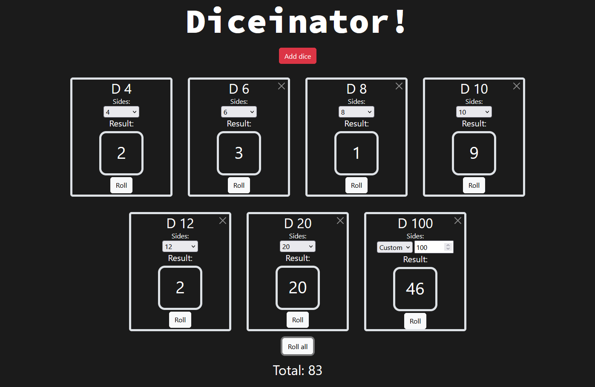

# Diceinator!
A very simple, **but totally rad** dice rolling app.

Add as many dice as required, set the amount of sides to anything from 2 to 9999 and click roll or roll all to get a random number generated.

Try it for yourself here: https://nathanauckett.github.io/Diceinator/

